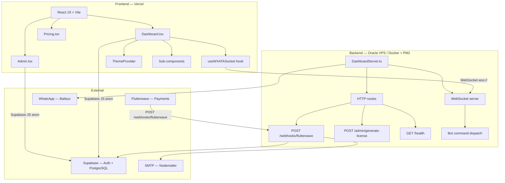

# Design Document — WXATA Production-Ready

## Overview

This document describes the technical design for bringing WXATA to a production-ready state. The work covers five major areas:

1. **Frontend page restoration** — rebuilding the empty `Dashboard.tsx` and `Admin.tsx` pages as composed sub-component trees
2. **Payment provider migration** — replacing Paystack with Flutterwave across the backend webhook handler and frontend checkout
3. **New bot commands** — adding `!pm`, `!dc`, `!owner`, and `!antibc` to the main bot loop
4. **Repository hygiene** — removing committed secrets, session files, dev artifacts, and updating documentation
5. **RLS policy fix** — adding an anon-accessible SELECT policy on `user_codes` to unblock registration validation

The system runs on Bun (backend) and React 19 + Vite (frontend). The backend uses raw `http.createServer` with a `ws` WebSocket server — no Express. The frontend communicates with the backend exclusively over WebSocket for real-time bot control and over the Supabase JS client for database reads.

---

## Architecture



### Key Architectural Decisions

**No new frontend libraries.** Drag-and-drop uses the HTML5 Drag and Drop API. Toast notifications use local React state. No new npm packages are introduced on the frontend.

**WebSocket-only bot control.** All bot commands (connect, restart, logout, update config) flow through the WebSocket. HTTP is used only for webhooks, health checks, and the admin license endpoint.

**Flutterwave webhook auth is direct string equality.** Flutterwave's verification model uses a pre-shared secret hash compared directly against the `verif-hash` header — not HMAC. This is by design and matches Flutterwave's documented approach.

**ThemeProvider already has localStorage persistence.** The existing `ThemeProvider.tsx` already reads from and writes to `localStorage`. The design documents the validation of unknown theme names as the only missing piece.

---

## Components and Interfaces

### Backend

#### `DashboardServer.ts` — HTTP route changes

**Remove:** The entire `POST /webhooks/paystack` block.

**Add:** `POST /webhooks/flutterwave`

```typescript
// Verification: direct string equality (NOT HMAC)
const receivedHash = req.headers['verif-hash'] as string | undefined;
const expectedHash = process.env.FLW_SECRET_HASH ?? '';
if (!receivedHash || receivedHash !== expectedHash) {
  res.writeHead(401); res.end('Unauthorized'); return;
}

// Event routing
if (event.event === 'charge.completed' && event.data.status === 'successful') {
  // provision: generateUserCode() + generateLicenseKey() + insert + sendCredentialsEmail()
} else if (isFailureEvent(event)) {
  // suspend: update user_codes set suspended=true where used_by = customerEmail
}
```

The handler wraps processing in `Promise.race` with a 4.5-second timeout, identical to the existing Paystack handler pattern.

#### `backend/index.ts` — New bot commands

Four new entries in `DEFAULT_BOT_INFO.scripts`:

| trigger | type | description |
|---------|------|-------------|
| `!pm`   | core | Permission manager — reads/writes `botInfo.permissions` |
| `!dc`   | core | Docs link — static response with docs URL |
| `!owner`| core | Owner vCard — sends contact card via `sock.sendMessage` |
| `!antibc`| core | Anti-broadcast toggle — reads/writes `backend/antibc.json` |

All four commands check `botInfo.permissions.numbers` and `fromMe` before executing. The `!pm` and `!antibc` commands call `saveBotInfo()` after mutating state.

**`!owner` vCard format:**
```typescript
await sock.sendMessage(remoteJid, {
  contacts: {
    displayName: botInfo.root.target,
    contacts: [{
      vcard: `BEGIN:VCARD\nVERSION:3.0\nFN:Bot Owner\nTEL;type=CELL;type=VOICE;waid=${ownerNumber}:+${ownerNumber}\nEND:VCARD`
    }]
  }
});
```

#### `backend/licenseValidator.ts` — No changes

The existing `generateLicenseKey` and `validateLicenseKey` functions are correct and already tested. No modifications needed.

### Frontend

#### `useWXATASocket(url: string)` hook

New file: `frontend/src/hooks/useWXATASocket.ts`

```typescript
interface WXATASocketState {
  socket: WebSocket | null;
  status: 'connecting' | 'connected' | 'disconnected' | 'reconnecting';
  attempt: number;
  send: (payload: unknown) => void;
  lastMessage: unknown;
}

const BACKOFF_DELAYS = [1000, 2000, 4000, 8000, 16000, 30000]; // ms

// On close (unexpected): schedule reconnect with BACKOFF_DELAYS[min(attempt, 5)]
// On open: reset attempt to 0, set status 'connected'
// On unmount: clearTimeout + socket.close()
// URL upgrade: replace ws:// with wss:// when window.location.protocol === 'https:'
```

The hook dispatches incoming messages to a `lastMessage` state value. The Dashboard component reads `lastMessage` in a `useEffect` and routes by `event` field.

#### `Dashboard.tsx` — Sub-component composition

```
Dashboard
├── StatusBar          — connection state, uptime, memory, reconnecting indicator
├── ConnectionPanel    — QR display (qrcode.react), pairing code, connect/disconnect buttons
├── LogPanel           — last 50 log entries, auto-scroll, color-coded by type
├── ScriptManager      — script list with expand/collapse, add form, delete, drag-reorder
├── PermissionsEditor  — allowAll toggle, chats list, numbers list
├── WelcomeEditor      — enabled toggle + text area
├── MiniMarketplace    — top extensions by downloads, install button
└── ThemeSwitcher      — dropdown of 10 available themes
```

**Auth guard:** On mount, Dashboard calls `supabase.auth.getSession()`. If no session, redirect to `/login`. If session username ≠ route param, redirect to `/login`.

**Toast system:** A `useToast()` hook backed by `useState<Toast[]>`. Toasts auto-dismiss after 2 seconds via `setTimeout`. No external library.

**Drag-reorder:** Each script row has a `draggable` attribute and `onDragStart`/`onDragOver`/`onDrop` handlers. The drop handler reorders the scripts array in local state and immediately sends `UPDATE_BOT_INFO`.

#### `Admin.tsx` — Passphrase-gated single page

```
Admin
├── PassphraseGate     — password form, checks against VITE_ADMIN_PASS || 'ROOT_ACCESS'
└── AdminPanel (unlocked)
    ├── CodeGenerator      — WX-XXXXXXXX format, push to DB
    ├── LicenseGenerator   — calls POST /admin/generate-license with Bearer token
    ├── IssuedCodesTable   — all user_codes rows, suspend/reinstate/delete actions
    ├── PendingExtensions  — pending marketplace_extensions, approve/edit/delete
    ├── ActiveExtensions   — approved extensions, trust/disable/edit/delete
    └── EditModal          — shared modal for editing any extension
```

The passphrase is stored in component state only — never in localStorage or a cookie.

#### `Pricing.tsx` — Flutterwave replacement

Remove all Paystack types, declarations, and script injection. Replace with:

```typescript
declare global {
  interface Window {
    FlutterwaveCheckout?: (opts: FlutterwaveOptions) => void;
  }
}

// Script injection (once on mount, only when VITE_FLW_PUBLIC_KEY is set)
useEffect(() => {
  if (!flwKey) return;
  if (document.getElementById('flw-inline-js')) return;
  const script = document.createElement('script');
  script.id = 'flw-inline-js';
  script.src = 'https://checkout.flutterwave.com/v3.js';
  script.async = true;
  document.body.appendChild(script);
}, [flwKey]);

// tx_ref generation
const txRef = `WXATA-${Date.now()}-${Math.random().toString(36).slice(2, 8)}`;
```

On success callback: set a local `paid` state to `true` and render an inline confirmation message. No redirect.

#### `ThemeProvider.tsx` — Unknown theme validation

Add validation in the lazy initializer:

```typescript
const KNOWN_THEMES: Theme[] = ['midnight', 'nord', 'cyberpunk', 'rose', 'ocean', 'forest', 'minimal', 'sepia', 'hacker', 'sunset'];

const [theme, setThemeState] = useState<Theme>(() => {
  const stored = localStorage.getItem('wxata-theme') as Theme | null;
  if (stored && KNOWN_THEMES.includes(stored)) return stored;
  if (stored) localStorage.removeItem('wxata-theme'); // clear invalid value
  return 'midnight';
});
```

The `useEffect` that writes to localStorage on theme change is already present and correct.

### Database

#### New migration: `supabase/migrations/002_rls_user_codes_anon.sql`

```sql
-- Allow anonymous (unauthenticated) clients to SELECT any row from user_codes.
-- This is required for the registration page to validate a user code before
-- the user has created a Supabase Auth account.
-- INSERT, UPDATE, DELETE remain restricted to the service role.
CREATE POLICY "user_codes_select_anon" ON user_codes
  FOR SELECT USING (true);
```

The existing `user_codes_select_own` policy (authenticated users see their own row) is preserved and continues to work alongside this new policy.

---

## Data Models

### WebSocket message protocol

All messages are JSON objects with an `event` field. The backend sends:

| event | payload type | description |
|-------|-------------|-------------|
| `status` | `SystemStatus` | Connection state, uptime, memory, pm2 flag |
| `log` | `DashboardLog` | `{ timestamp, type, message }` |
| `qr` | `string` | QR code data string for `qrcode.react` |
| `pairing-code` | `string` | 8-digit pairing code |
| `bot-info` | `BotInfo` | Full BotInfo object |

The frontend sends:

| event | payload | description |
|-------|---------|-------------|
| `START_CONNECTION` | `{ method: 'QR' \| 'PHONE', phone?: string }` | Initiate WhatsApp connection |
| `RESTART` | — | Restart the bot process |
| `LOGOUT` | — | Log out of WhatsApp |
| `TERMINATE` | — | Terminate the process (PM2 stops, no restart) |
| `UPDATE_BOT_INFO` | `BotInfo` | Persist updated bot configuration |

### BotInfo shape (existing, unchanged)

```typescript
interface BotInfo {
  prefix: string;
  scripts: Script[];
  permissions: {
    allowAll: boolean;
    chats: string[];
    numbers: string[];
  };
  welcome: {
    enabled: boolean;
    text: string;
  };
  root: {
    target: string;
  };
}

interface Script {
  trigger: string;
  response: string;
  type: 'core' | 'custom';
  // ... other fields
}
```

### Flutterwave webhook payload (relevant fields)

```typescript
interface FlutterwaveWebhookEvent {
  event: string;           // e.g. 'charge.completed'
  data: {
    status: string;        // 'successful' | 'failed' | 'cancelled'
    customer: {
      email: string;
      name: string;
    };
    amount: number;
    currency: string;
    tx_ref: string;
  };
}
```

### `antibc.json` shape

```typescript
interface AntibcConfig {
  enabled: boolean;
  message: string;
}
```

---

## Correctness Properties

*A property is a characteristic or behavior that should hold true across all valid executions of a system — essentially, a formal statement about what the system should do. Properties serve as the bridge between human-readable specifications and machine-verifiable correctness guarantees.*

### Property 1: License key round-trip

*For any* non-empty username string (containing no colon) and any non-empty secret string, `validateLicenseKey(generateLicenseKey(username, secret), secret)` must return `true`.

**Validates: Requirements 15.4**

---

### Property 2: License key tamper detection

*For any* valid license key generated by `generateLicenseKey`, modifying any single character in the HMAC portion of the key must cause `validateLicenseKey` to return `false`.

**Validates: Requirements 15.4**

---

### Property 3: Flutterwave webhook auth rejects all non-matching hashes

*For any* string value of the `verif-hash` header that is not equal to `FLW_SECRET_HASH`, the `POST /webhooks/flutterwave` handler must respond with HTTP 401 and must not perform any provisioning side effects (no Supabase insert, no email send).

**Validates: Requirements 13.2, 13.3**

---

### Property 4: WebSocket reconnect backoff is non-decreasing and bounded

*For any* attempt index N ≥ 0, the reconnect delay produced by `useWXATASocket` must satisfy:
- `delay(N) = min(1000 × 2^N, 30000)` milliseconds
- `delay(N) ≥ delay(N-1)` for all N ≥ 1
- `delay(N) ≤ 30000` for all N

**Validates: Requirements 1.9, 8.2**

---

### Property 5: Theme persistence round-trip

*For any* valid theme name in the known themes list, calling `setTheme(name)` must result in `localStorage.getItem('wxata-theme') === name`, and re-initialising `ThemeProvider` with that localStorage state must restore the same theme.

**Validates: Requirements 1.18, 1.19, 9.1, 9.2**

---

### Property 6: Unknown theme falls back to default

*For any* string that is not a member of the known themes list (`['midnight', 'nord', 'cyberpunk', 'rose', 'ocean', 'forest', 'minimal', 'sepia', 'hacker', 'sunset']`), initialising `ThemeProvider` with that value in localStorage must result in the `'midnight'` default theme being applied and the invalid value being cleared from localStorage.

**Validates: Requirements 9.4**

---

### Property 7: User code uniqueness

*For any* N calls to `generateUserCode()` where N ≤ 1000, all N returned values must be distinct (collision probability < 1/2^64 by the birthday bound on 16-char alphanumeric codes from a 62-character alphabet).

**Validates: Requirements 13.4, 15.1**

---

### Property 8: Marketplace author search filters correctly

*For any* search string S and any list of extensions, every extension returned by the author filter must have an `author` field that contains S (case-insensitive), and every extension whose `author` does not contain S must be excluded.

**Validates: Requirements 25.1**

---

## Error Handling

### Flutterwave webhook

| Condition | Response | Side effects |
|-----------|----------|-------------|
| Missing or wrong `verif-hash` | 401 Unauthorized | None |
| Malformed JSON body | 400 Bad Request | None |
| `charge.completed` + `status: "successful"` + Supabase insert fails | 500 Internal Server Error | Error logged via pino |
| `charge.completed` + `status: "successful"` + email send fails | 500 Internal Server Error | User code already inserted; error logged |
| Processing exceeds 4.5 seconds | 500 (timeout) | Partial side effects possible; logged |
| Unknown event type | 200 OK | None (acknowledge to prevent retries) |

### WebSocket reconnect

The `useWXATASocket` hook distinguishes between intentional closes (component unmount, user-initiated logout) and unexpected closes. Only unexpected closes trigger the backoff reconnect loop. The hook sets `status: 'reconnecting'` during backoff so the `StatusBar` can display a visible indicator.

### ThemeProvider

If `localStorage` is unavailable (e.g., private browsing with storage blocked), the `useState` initializer catches the exception and falls back to `'midnight'`. The `useEffect` write is similarly wrapped in a try/catch.

### Admin panel

All Supabase operations in `Admin.tsx` are wrapped in try/catch. Errors are displayed inline as red alert banners rather than crashing the component. The passphrase is never sent to the backend except as the `Authorization: Bearer` header on the `/admin/generate-license` call.

### Bot commands

All four new commands (`!pm`, `!dc`, `!owner`, `!antibc`) catch errors from `sock.sendMessage` and log them via the existing dashboard logger. File write failures in `!pm` and `!antibc` are caught and reported back to the user via a WhatsApp reply.

---

## Testing Strategy

### Property-based testing (fast-check)

The project already uses `fast-check` in both `backend/__tests__/` (Bun test runner) and `frontend/src/__tests__/` (Vitest). New property tests follow the same patterns.

**Backend property tests** (`backend/__tests__/`):

- **Property 1 & 2** (license key round-trip and tamper detection): Already covered by the existing `licenseValidator.test.ts`. No new test needed — the existing tests satisfy these properties.
- **Property 3** (Flutterwave webhook auth): New test in `backend/__tests__/flutterwaveWebhook.test.ts`. Uses a minimal test HTTP server (same pattern as `webhook.test.ts`). For any random string ≠ `FLW_SECRET_HASH`, assert 401 and no side effects. Minimum 100 iterations.
  - Tag: `Feature: wxata-production-ready, Property 3: Flutterwave webhook auth rejects all non-matching hashes`
- **Property 7** (user code uniqueness): New test in `backend/__tests__/flutterwaveWebhook.test.ts`. Generate N codes, assert all distinct. Minimum 100 iterations.
  - Tag: `Feature: wxata-production-ready, Property 7: User code uniqueness`

**Frontend property tests** (`frontend/src/__tests__/`):

- **Property 4** (WebSocket reconnect backoff): New test in `frontend/src/__tests__/useWXATASocket.test.ts`. For any attempt index N in [0..20], assert `delay(N) === Math.min(1000 * Math.pow(2, N), 30000)`. Pure function test — no DOM needed. Minimum 100 iterations.
  - Tag: `Feature: wxata-production-ready, Property 4: WebSocket reconnect backoff is non-decreasing and bounded`
- **Property 5 & 6** (theme persistence): New test in `frontend/src/__tests__/themeProvider.test.tsx`. Mock `localStorage`. For any valid theme name, assert round-trip. For any invalid string, assert fallback to `'midnight'`. Minimum 100 iterations each.
  - Tag: `Feature: wxata-production-ready, Property 5: Theme persistence round-trip`
  - Tag: `Feature: wxata-production-ready, Property 6: Unknown theme falls back to default`
- **Property 8** (marketplace author search): New test in `frontend/src/__tests__/marketplace.test.tsx`. Generate random extension lists and search strings, assert filter correctness. Minimum 100 iterations.
  - Tag: `Feature: wxata-production-ready, Property 8: Marketplace author search filters correctly`

### Unit tests (example-based)

**Backend:**
- `flutterwaveWebhook.test.ts`: `charge.completed` success path, failure path, unknown event, timeout simulation, Supabase error, email error
- Bot command handlers (`!pm`, `!dc`, `!owner`, `!antibc`): permission check, each sub-command, invalid input

**Frontend:**
- `Dashboard.tsx`: auth redirect (no session), auth redirect (username mismatch), WebSocket event handling (status, log, qr, pairing-code, bot-info), control commands, toast display, script validation (empty trigger rejected)
- `Admin.tsx`: passphrase gate (correct, incorrect), code generation format, license key copy
- `Pricing.tsx`: Flutterwave script injection when key present, no injection when key absent, tx_ref format
- `ThemeProvider.tsx`: default theme when localStorage empty, localStorage write on setTheme

### Integration tests

- Supabase anon client can SELECT from `user_codes` after migration 002 is applied (manual verification or Supabase local dev)
- Flutterwave webhook end-to-end: real HTTP request to local server with correct `verif-hash`, assert 200 and Supabase row inserted (requires test Supabase instance)

### Smoke tests

- `POST /webhooks/flutterwave` route exists (returns 401 without header, not 404)
- `backend/.env.example` contains `FLW_SECRET_HASH`, does not contain `PAYSTACK_SECRET_KEY`
- `frontend/.env.example` contains `VITE_FLW_PUBLIC_KEY`, does not contain `VITE_PAYSTACK_PUBLIC_KEY`
- `backend/auth_info/` is in `backend/.gitignore`
- `scratch/`, `refactor_v2.js`, `frontend/refactor_themes.js` are absent from the repository
